# Documentação
  

# Projeto: Achar o menor preço de produtos. 

`CURSO` 

  Ciências da Computação - Pontifícia universidade católica de Minas Gerais

## Alunos integrantes da equipe

* Gustavo Pessoa Firmino Duarte
* Henrique Moura de Sousa Belo
* João Vitor Gonzaga Jota 
* Matheus
* Raphael Denner de Oliveira
* Yuri Rainer Bedran

## Professores responsáveis

* Cleiton Silva Tavares
* Luciana Mara Freitas Diniz
* Romel Vieira Carneiro

# Estrutura do Documento

- [Informações do Projeto](#informações-do-projeto)
  - [Participantes](#participantes)
- [Estrutura do Documento](#estrutura-do-documento)
- [Introdução](#introdução)
  - [Problema](#problema)
  - [Objetivos](#objetivos)
  - [Justificativa](#justificativa)
  - [Público-Alvo](#público-alvo)
- [Especificações do Projeto](#especificações-do-projeto)
  - [Personas e Mapas de Empatia](#personas-e-mapas-de-empatia)
  - [Histórias de Usuários](#histórias-de-usuários)
  - [Requisitos](#requisitos)
    - [Requisitos Funcionais](#requisitos-funcionais)
    - [Requisitos não Funcionais](#requisitos-não-funcionais)
  - [Restrições](#restrições)
- [Projeto de Interface](#projeto-de-interface)
  - [User Flow](#user-flow)
  - [Wireframes](#wireframes)
- [Metodologia](#metodologia)
  - [Divisão de Papéis](#divisão-de-papéis)
  - [Ferramentas](#ferramentas)
  - [Controle de Versão](#controle-de-versão)
- [**############## SPRINT 1 ACABA AQUI #############**](#-sprint-1-acaba-aqui-)
- [Projeto da Solução](#projeto-da-solução)
  - [Tecnologias Utilizadas](#tecnologias-utilizadas)
  - [Arquitetura da solução](#arquitetura-da-solução)
- [Avaliação da Aplicação](#avaliação-da-aplicação)
  - [Plano de Testes](#plano-de-testes)
  - [Ferramentas de Testes (Opcional)](#ferramentas-de-testes-opcional)
  - [Registros de Testes](#registros-de-testes)
- [Referências](#referências)

# Introdução
Encontrar melhores preços de produtos é uma necessidade que abrange toda a sociedade, visto que poupar dinheiro é uma forma efetiva para alcançar o maior acúmulo de capital e obter uma maior folga no seu orçamento relativo a sua renda, podendo assim ter uma maior qualidade de vida.

Os comércios em geral, possuem uma tabela de preço similar, isto quer dizer que a diferença de preços de comércio para comércio, referentes a um mesmo produto, geralmente não vai ser exorbitante. Porém, quando se observa a somatória dos valores de uma compra do mês para uma residência, por exemplo, a pequena diferença entre os preços dos estabelecimentos, pode se tornar uma grande diferença no valor total da compra.

Visto isso, faz-se útil a utilização de algum tipo de serviço que faça essa comparação antes mesmo de acontecer a locomoção física até o local de compra, ou até mesmo por uma compra online, já que ambas as formas de compra gastam o dinheiro do consumidor, ou com o pagamento da taxa de frete ou com a gasolina que abastece o carro, o privilégio de ter um estabelecimento como um supermercado que se possa acessar a pé é para poucas pessoas.

A proposta do nosso site é justamente essa, facilitar ao máximo a vida dos usuários, mostrando onde estão os produtos mais baratos e a sua proximidade, ao mesmo tempo, oferecer grande ajuda as empresas que postarão seus produtos em nosso site .

## Problema
Conforme dito na introdução, o problema principal a ser enfrentado neste projeto é atender as necessidades dos usuários, dando a possibilidade de comparar preços de produtos desejados. Dito isso, o principal obstáculo é encontrar uma forma de fazer com que os usuários possam encontrar seus produtos desejados com maior comodidade e conforto apenas no alcance de alguns cliques.
## Objetivos
O objetivo geral deste trabalho é criar uma plataforma onde os usuário podem se cadastrar como consumidores que irão buscar e comparar preços de produtos desejados dentro de um raio de alcance da sua localização atual, ou então como empresas donas de lojas que podem cadastrar seus produtos para que fique disponíveis para todos os usuários consumidores dentro de um determinado raio de alcance, também usando como base sua geolocalização.

Como objetivos específicos, podemos ressaltar:
Fornecer funcionalidades de cadastro de produtos;
Fornecer funcionalidades de comparação de preços e busca de produtos através de filtros de interesses;
Permitir a navegação de um mapa a fim de conhecer a distância do usuário até a loja mais próxima com o produto disponível;

## Justificativa
Atualmente o Brasil se encontra em um período de crise, por isso, economizar em todos os aspectos possíveis é essencial, nosso site vem para solucionar este problema, sendo que ajuda os usuários a encontrar estabelecimentos por perto comparando o preço dos produtos e ao mesmo tempo ajuda o comércio local evitando o  desperdício, prejuízo e fechamento dos mesmos como aconteceu durante a pandemia, mostra também qual estabelecimento se encontra mais perto, fazendo com que os estabelecimentos ganhem uma clientela local.

## Público-Alvo
Para o público alvo deste projeto, existem dois tipos de público a serem alcançados através da plataforma, o consumidor e o vendedor. O consumidor é a pessoa que deseja encontrar produtos dentro de seu bairro ou cidade sem sair de casa e comparar preços a fim de ter mais comodidade e conforto na hora da compra ou orçamento. Já o vendedor é o dono de loja ou representante de empresa que deseja disponibilizar suas mercadorias na plataforma para alcançar um número maior de clientes dentro de um raio de alcance de uma de suas instalações de lojas.

Desta forma, é possível concluir que o público alvo são pessoas em seu ambiente doméstico procurando algum bem-material com o menor preço e maior qualidade perto de sua casa ou empreendedores que querem expandir seus negócios e conseguir mais clientes a fim de melhorar suas vendas.
 
# Especificações do Projeto

O projeto é uma aplicação web, desenvolvida a partir dos conhecimentos obtidos na disciplina de Desenvolvimento de interfaces web, utilizando HTML, CSS e javascript,  a princípio o site deverá ser capaz de permitir o cadastro de produtos pelas empresas interessadas tal qual permitir que um usuário visualize os produtos com melhor custo-benefício. O site deverá ter:
* Uma tela de cadastro
* Uma tela de login
* Uma tela de usuário(pessoa)
* Uma tela de usuário(empresa)
* Uma tela de produtos permitindo filtrá-los

## Personas 
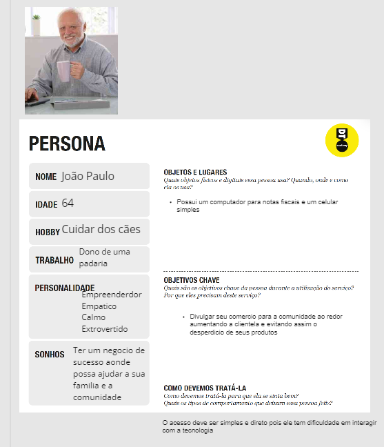
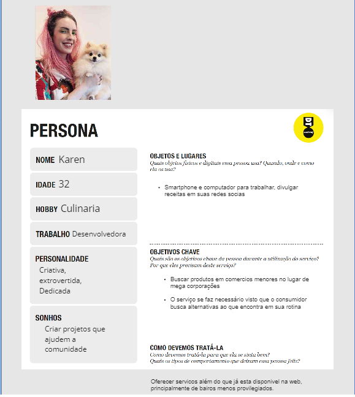
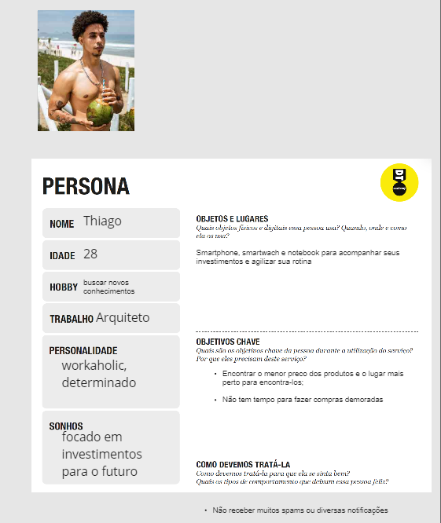
## Mapas de Empatia

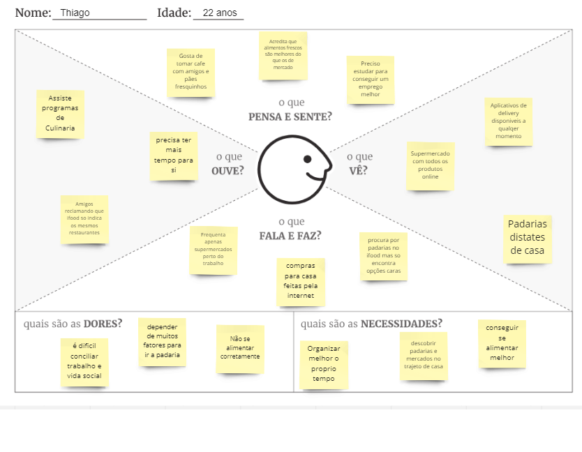

## Histórias de Usuários
Com base na análise das personas forma identificadas as seguintes histórias de usuários:
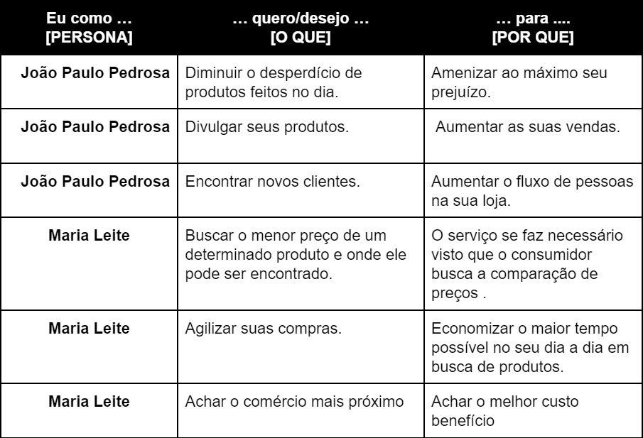

## Requisitos

As tabelas que se seguem apresentam os requisitos funcionais e não funcionais que detalham o escopo do projeto.

### Requisitos Funcionais

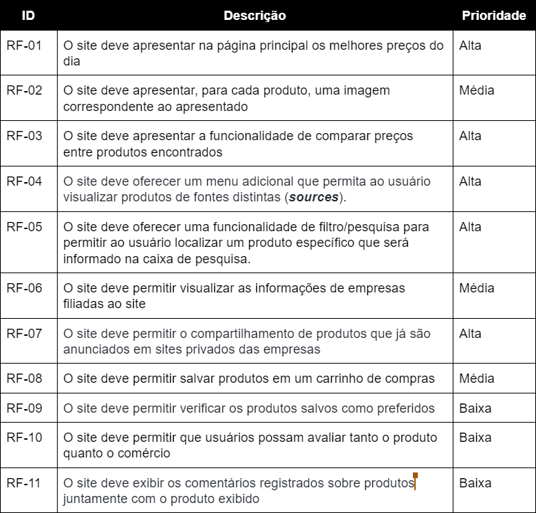

### Requisitos não Funcionais

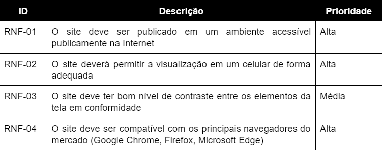

## Restrições

O projeto está restrito pelos itens apresentados na tabela a seguir.

|ID| Restrição                                             |
|--|-------------------------------------------------------|
|01| O projeto deverá ser entregue até o final do semestre |
|02| Não pode ser desenvolvido um módulo de backend        |
|03| A equipe não pode subcontratar o desenvolvimento do trabalho| 

> Enumere as restrições à sua solução. Lembre-se de que as restrições
> geralmente limitam a solução candidata.
> 
> **Links Úteis**:
> - [O que são Requisitos Funcionais e Requisitos Não Funcionais?](https://codificar.com.br/requisitos-funcionais-nao-funcionais/)
> - [O que são requisitos funcionais e requisitos não funcionais?](https://analisederequisitos.com.br/requisitos-funcionais-e-requisitos-nao-funcionais-o-que-sao/)

# Projeto de Interface

## A Interface em níveis: 

| Nome  da Tela                          | Função                      |
|---------------------------------|-----------------------------|
|Tela Inicial   |Conter as principais funções da aplicação em um lugar simples e direto| 
|Tela de Cadastro     |Permitir ao usuário se cadastrar em um ambiente personalizado para usuário-pessoa/usuário-empresa| 
|Tela de Usuário-Pessoa          |Conter todas as informações do perfil de um usuário, permitindo editar e adicionar informações complementares(redes sociais etc.)| 
|Tela de Usuário-Empresa |Conter todas as informações de um usuário-empresa, permitindo verificar os produtos listados, suas avaliações e seus preços comparados com a concorrência|
|Tela de Busca              |Executar a busca do produto solicitado pelo usuário de acordo com os filtros solicitados| 

## User Flow
O fluxo de usuário foi imaginado da seguinte forma, as telas serão explicadas na seção de wireframes.

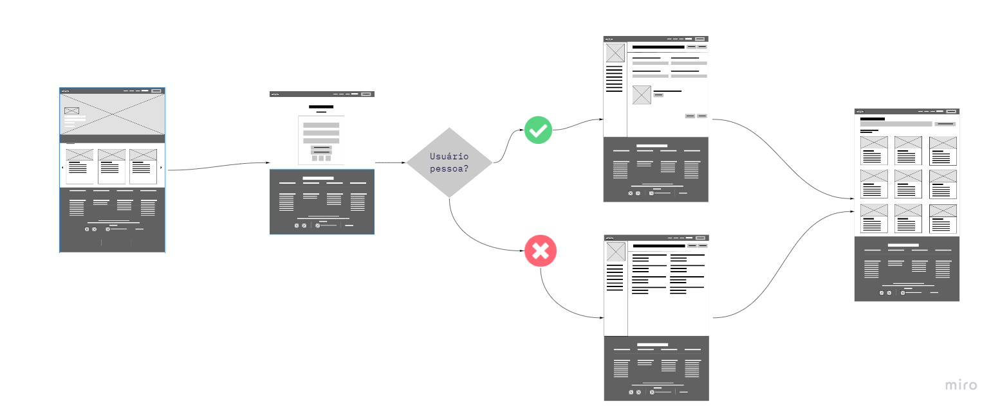

## Wireframes
# Tela Inicial
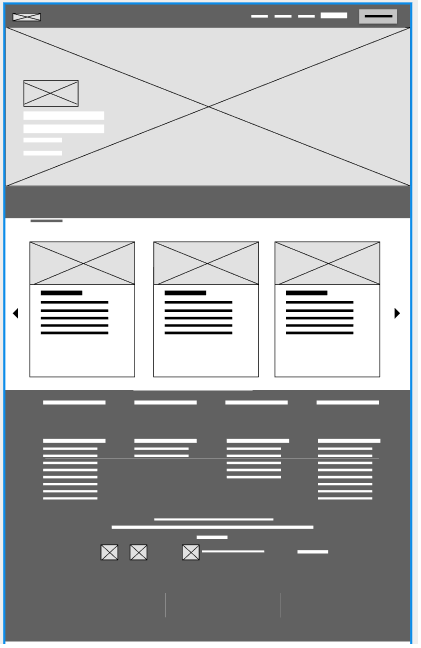
# Tela de Cadastro
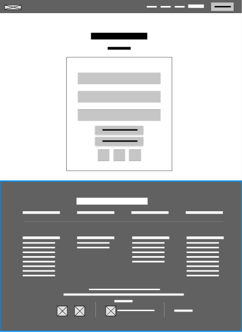
# Tela de Usuário-Pessoa
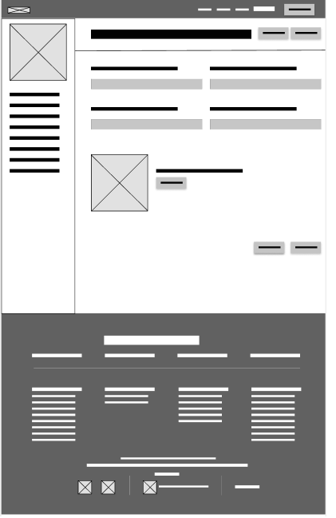
# Tela de Usuário-Empresa
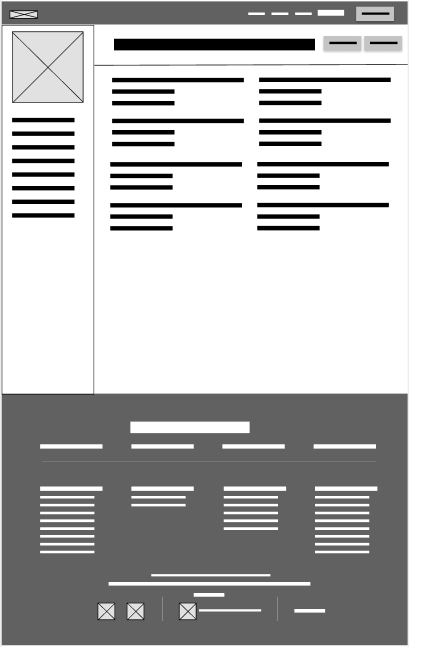
# Tela de Busca
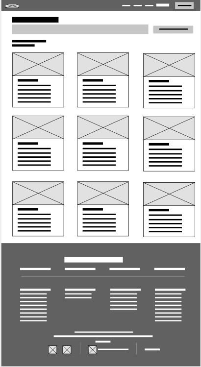

# Metodologia

A princípio o grupo teve seu primeiro encontro em sala de aula, foi criado o primeiro esboço do que seria o foco para a aplicação: focar em produos alimentícios de grandes e pequenos negócios. Após definir o eixo temático se iniciou o processo de design thinking desenvolvendo a Matriz CSD, o Mapa de Priorização e o Mapa de Stakeholders,após isso foram elaboradas perguntas que foram perguntadas a familiares dos membros do grupo. O próximo passo foi o desenvolvimento do  Diagrama de Personas a partir das entrevistas, até então todos esses processos estavam sendo desenvolvidos de forma analógica, por meio das folhas fornecidas pelos orientadores da disciplina mas após essa etapa, a plataforma MIRO começou a ser utilizada para digitalizar esses processos tal qual adicionar o Mural de Possibilidades e o Mapa de Empatia.

Com um maior entendimento do eixo temático do projeto foi desenvolvido um esboço do que virá a se tornar a aplicação por meio da montagem do wireframe utilizando a plataforma Figma incluindo um protótipo interativo. A próxima etapa foi criar a documentação, que o grupo criou utilizando a plataforma colaborativa Google Docs.Em seguida todos esses documentos foram hospedados no Github, adaptando a documentação para o formato Markdown. A última etapa foi compilar todo o conteúdo produzido em uma apresentação, que irá ocorrer no dia 27/09.

É importante ressaltar que a metodologia Scrum foi implementada no projeto a partir da divisão de tarefas utilizando o Trello, e nas reuniões diárias que ocorreram na parte da noite via Discord.
## Divisão de Papéis (Sprint1)

| Nome                            | Função                      |
|---------------------------------|-----------------------------|
|Gustavo Pessoa Firmino Duarte    |Documentação, desenvolvimento, criação do powerpoint| 
|Henrique Moura de Sousa Belo     |Documentação, desenvolvimento, adaptação para o github| 
|João Vitor Gonzaga Jota          |Documentação, desenvolvimento, criação dos wireframes utilizando o figma| 
|Raphael Denner de Oliveira       |Documentação, desenvolviemento, criação dos wireframes utilizando o figma|
|Yuri Rainer Bedran               |Documentação, desenvolviemnto, adaptação para o github, criação do powerpoint| 

## Sprints 2 e 3

Na segunda e na terceira parte do projeto, o grupo foi orientado a se dividir e cada um foi responsável por desenvolver 2 funcionalidades para o projeto. As entregas foram em outubro e novembro respectivamente. Nesse momento do projeto foi possível observar o que funcionaria e o que não funcionaria, algumas ideias foram descartadas, outras modificadas, porém todas as funcionalidades funcionaram individualmente. 

## Divisão de Papéis (Sprint2 e 3)

| Nome                            | Função                      |
|---------------------------------|-----------------------------|
|Gustavo Pessoa Firmino Duarte    |Mapa, Lista de Desejos| 
|Henrique Moura de Sousa Belo     |Pesquisa e Filtro| 
|João Vitor Gonzaga Jota          |Tela de início, Tela de menor Preço| 
|Raphael Denner de Oliveira       |Tela de Contato, Cadastro de Empresas|
|Yuri Rainer Bedran               |Cadastro de usuários, tela individual de produtos| 

##Sprint 4

Na parte final do projeto, a tarefa foi combinar as ferramentas individuais, as telas de destaque e menor preço foram combinadas a fim de melhorar a experiência do usuário. As outras telas foram integradas, porém foi necessário padronizar os elementos gráficos e deixer o código mais organizado.

## Divisão de Papéis (Sprint 4)

| Nome                            | Função                      |
|---------------------------------|-----------------------------|
|Gustavo Pessoa Firmino Duarte    |Documentação, Código| 
|Henrique Moura de Sousa Belo     |Documentação, Código, Vídeo| 
|João Vitor Gonzaga Jota          |Documentação, Código| 
|Raphael Denner de Oliveira       |Documentação, Código|
|Yuri Rainer Bedran               |Documentação, Código| 

## Ferramentas

| Ambiente  | Plataforma              |Link de Acesso |
|-----------|-------------------------|---------------|
|Processo de Design Thinkgin  | Miro |  https://miro.com/app/board/uXjVPZ375T8=/ | 
|Repositório de código | GitHub | https://github.com/ICEI-PUC-Minas-PPLCC-TI/tiaw-ppl-cc-m-20222-grupo-1-menor-preco | 
|Wireframe e user flow | Figma | https://www.figma.com/file/cdVetI5SuPrJpdZhbRGA62/Low-Fidelity-Wireframes-(Community)?node-id=203%3A195 |
|Desenvolvimento inicial da documentação | Google Docs |  https://docs.google.com/document/d/1pcj7V9U0ncFyhb01YhRmekfpDjDIzOqOC8AjDKhWCyw/edit# |
|Editor de código | Visual Studio Code | https://code.visualstudio.com |
|Gerenciamento de projeto | Trello |  https://trello.com |

## Controle de Versão

O [Git](https://git-scm.com/) foi a ferramenta de controle de versão escolhido. Por ele nós vamos subir os arquivos para o repositório hospedado no [Github](https://github.com).

 O projeto segue a seguinte convenção para o nome de branchs:

> - `master`: versão estável já testada do software

> - `dev`: versão de desenvolvimento do software

# **############## SPRINT 1 ACABA AQUI #############**

# Projeto da Solução

Nesta seção são apresentados os detalhes técnicos da solução criada pelo grupo, tratando da arquitetura da aoluçãoas, as estruturas de dados e as telas já implementadas.

## Tecnologias Utilizadas

Para implementar a solução do projeto, foram utilizadas as linguagens HTML (HyperText Markup Language) que é o componente básico da web, assim, ele permite inserir o conteúdo e  , CSS e JavaScript.

 O HTML é o componente básico da web, ele permite inserir o conteúdo e estabelecer a estrutura básica de um website. 

> Descreva aqui qual(is) tecnologias você vai usar para resolver o seu
> problema, ou seja, implementar a sua solução. Liste todas as
> tecnologias envolvidas, linguagens a serem utilizadas, serviços web,
> frameworks, bibliotecas, IDEs de desenvolvimento, e ferramentas.
> Apresente também uma figura explicando como as tecnologias estão
> relacionadas ou como uma interação do usuário com o sistema vai ser
> conduzida, por onde ela passa até retornar uma resposta ao usuário.
> 
> Inclua os diagramas de User Flow, esboços criados pelo grupo
> (stoyboards), além dos protótipos de telas (wireframes). Descreva cada
> item textualmente comentando e complementando o que está apresentado
> nas imagens.

> Como proposto pelo trabalho nossas tecnologias usadas foram: HTML (HyperText Markup Language), Css, JavaScript, Json, Visual studio code, replit, Miro, Figma, GitHub e API para mapas

> HTML (HyperText Markup Language), Css, JavaScript, Json e a API foram usados para montagem do site.
> Visual studio code e replit foram usados para a compilação dos códigos.
> Miro, Figma e GitHub foram usados para o desenvolvimento criativo e para upload de códigos.

## Arquitetura da solução

......  COLOQUE AQUI O SEU TEXTO E O DIAGRAMA DE ARQUITETURA .......

> Inclua um diagrama da solução e descreva os módulos e as tecnologias
> que fazem parte da solução. Discorra sobre o diagrama.
> 
> **Exemplo do diagrama de Arquitetura**:
> 
> 

# Avaliação da Aplicação

......  COLOQUE AQUI O SEU TEXTO ......

> Apresente os cenários de testes utilizados na realização dos testes da
> sua aplicação. Escolha cenários de testes que demonstrem os requisitos
> sendo satisfeitos.
## Plano de Testes

......  COLOQUE AQUI O SEU TEXTO ......

> Enumere quais cenários de testes foram selecionados para teste. Neste
> tópico o grupo deve detalhar quais funcionalidades avaliadas, o grupo
> de usuários que foi escolhido para participar do teste e as
> ferramentas utilizadas.
> 
> **Links Úteis**:
> - [IBM - Criação e Geração de Planos de Teste](https://www.ibm.com/developerworks/br/local/rational/criacao_geracao_planos_testes_software/index.html)
> - [Práticas e Técnicas de Testes Ágeis](http://assiste.serpro.gov.br/serproagil/Apresenta/slides.pdf)
> -  [Teste de Software: Conceitos e tipos de testes](https://blog.onedaytesting.com.br/teste-de-software/)
## Ferramentas de Testes (Opcional)

......  COLOQUE AQUI O SEU TEXTO ......

> Comente sobre as ferramentas de testes utilizadas.
> 
> **Links Úteis**:
> - [Ferramentas de Test para Java Script](https://geekflare.com/javascript-unit-testing/)
> - [UX Tools](https://uxdesign.cc/ux-user-research-and-user-testing-tools-2d339d379dc7)
## Registros de Testes

......  COLOQUE AQUI O SEU TEXTO ......

> Discorra sobre os resultados do teste. Ressaltando pontos fortes e
> fracos identificados na solução. Comente como o grupo pretende atacar
> esses pontos nas próximas iterações. Apresente as falhas detectadas e
> as melhorias geradas a partir dos resultados obtidos nos testes.

# Referências

......  COLOQUE AQUI O SEU TEXTO ......

> Inclua todas as referências (livros, artigos, sites, etc) utilizados
> no desenvolvimento do trabalho.
> 
> **Links Úteis**:
> - [Formato ABNT](https://www.normastecnicas.com/abnt/trabalhos-academicos/referencias/)
> - [Referências Bibliográficas da ABNT](https://comunidade.rockcontent.com/referencia-bibliografica-abnt/)
Footer
© 2022 GitHub, Inc.
Footer navigation
Terms
Privacy
Security
Status
Docs
Contact GitHub
Pricing
API
Training
Blog
About

# Referências

> **Links Úteis**:
> - [Formato ABNT](https://www.normastecnicas.com/abnt/trabalhos-academicos/referencias/)
> - [Referências Bibliográficas da ABNT](https://comunidade.rockcontent.com/referencia-bibliografica-abnt/)

